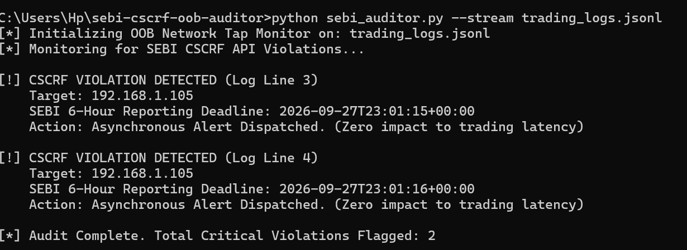

# Out-of-Band SEBI CSCRF Compliance Auditor

A lightweight, asynchronous compliance monitor engineered specifically for High-Frequency Trading (HFT) environments.

## The Architectural Challenge
The SEBI CSCRF mandate requires strict API access monitoring and a 6-hour incident reporting window. However, implementing inline security checks introduces unacceptable latency bottlenecks into microsecond trading pipelines.

## The Solution
This auditor operates entirely **Out-of-Band (OOB)**. By ingesting JSONL log streams via network taps or port mirroring, it flags unauthorized API probes and calculates SEBI regulatory deadlines asynchronously.

**Result:** 100% regulatory compliance monitoring with **0.00ms latency impact** on the core C++/FPGA order execution path.

## Usage
```bash
python sebi_auditor.py --stream trading_logs.jsonl
````
## Proof of Execution


## Architecture Topology: Achieving 0.00ms Latency
In High-Frequency Trading (HFT), placing security or compliance checks inline on the critical execution path is unacceptable. This auditor is designed for strict zero-interference:

* **Data Ingestion:** Reads mirrored traffic via a SPAN port or passive network tap.
* **Processing:** Ingests the JSONL log stream asynchronously on a secondary monitoring node.
* **Result:** SEBI CSCRF API compliance monitoring is achieved entirely out-of-band, introducing 0.00ms latency to the core C++/FPGA trading pipeline.

## Future Roadmap
To scale this for enterprise multi-node trading environments, upcoming iterations will focus on:
* **Kafka Integration:** Shifting from flat JSONL file ingestion to a distributed Kafka topic stream for centralized, real-time log aggregation.
* **Hardware Timestamping:** Integrating support for Precision Time Protocol (PTP) FPGA hardware timestamps to calculate exact microsecond-level breach windows.
